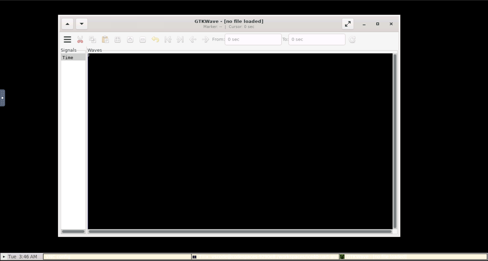

# ice40-uart-alu
Assignment for Winter 2025 - CSE 293 (Verilog to Silicon)

## Setup

```bash
git clone https://github.com/gmejiamtz/ice40-uart-alu.git
cd ice40-uart-alu
git submodule update --init --recursive
#Flashing ICE40 Requires OSS-CAD Suite installed
make icestorm_icebreaker_flash
```

# OSS Cad Suite Usage
To use the OSS Cad Suite Tools use the following commands upon creating a new VSCode terminal
```bash
source /tools/oss-cad-suite/environment
```

## Opening Waveforms
To open a waveform do the following steps:

1. Open the ports tab- this is found in the `Ports` tab of the VSCode Terminal as shown below


2. Hover over the `Forwarded Address` column and click on the `Open in Browser` icon/middle icon

3. Click on Connect in `NoVNC`
    - If prompted for a password enter `vscode`
4. Go to the bottom right triange to open the taskbar menu

5. Click on `Terminal`

6. Follow the instructions in [OSS Cad Suite Usage](#oss-cad-suite-usage) to use the OSS Cad Suite in this terminal

7. Run the following command

```bash
gtkwave $PATH_TO_WAVEFORM_FILE
```

8. Use GTKWave as needed
    - Below is an image of what the lite desktop should look with GTKWave open with no file


